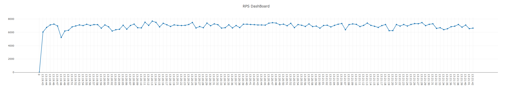

# Simple async load testing framework

基于asyncio的异步负载测试框架，优点是使用单机多进程模式，每个进程单独的event loop可以提供高并发和多客户端。

## How to use

使用时只需继承[Client Protocol](./benchmark_tools/client_protocol.py)编写您的客户端的实现。我们以一个http接口作为实示例，我们有一个http服务，接受一个post请求，数据为json，成功后会返回文本结果，我们可以编写如下的客户端实现：

```python
# examples/http_post.py
import asyncio
from benchmark_tools import ClientProtocol
import aiohttp
from typing import Union, Optional


class HttpClient(ClientProtocol):
    json_str = None

    def __init__(self):
        super().__init__()
        self._url: Union[None, str] = None
        self._conn: Union[None, aiohttp.TCPConnector] = None
        self._session: Union[None, aiohttp.ClientSession] = None

    @staticmethod
    def global_init(custom_conf: Optional[dict] = None):
        assert custom_conf is not None
        with open(custom_conf['test_data_file'], 'r') as f:
            HttpClient.json_str = f.read()

    def init_before_use(self, host):
        self._conn = aiohttp.TCPConnector(limit=0)
        self._session = aiohttp.ClientSession(connector=self._conn, headers={'content-type': 'text/plain'})
        self._url = host

    async def shutdown(self) -> None:
        if self._session is not None:
            await self._session.close()

    async def execute(self) -> Optional[bool]:
        async with self._session.post(self._url, data=self.json_str) as response:
            # read all data
            _ = await response.text()
            if response.status != 200:
                raise ValueError(f'response with err http status code:{response.status}')

```

我们在钩子函数global_init中加载测试样例，供所有客户端共享使用。注意这个函数签名是静态的，作为全局初始化的入口。然后在钩子init_before_use中对我们的http客户端进行初始化，这里使用session使得客户端可以keepalive，最后在钩子函数shutdown中进行一些清理工作。执行业务的钩子函数是execute，在这里需要实现自己的异步业务操作。在这个例子中我们简单的post一个json数据到服务器，并读取返回的数据，如果http status code不为200，则反馈一个错误。

完成了客户端的编写，我们再来编写测试的配置文件：

```yaml
host: "http://127.0.0.1:6301/test" # 服务器地址，将会通过init_before_use传递给客户端
users: 800 # 最大客户端数量
hatch_rate: 40 # 每秒追加的客户端数量
run_time: 120 # 跑测试件
worker: 4 # 测试使用进程数
benchmark_class_file: ./examples/http_post.py #客户端文件
wait_time: 0 # 每次请求后等待的时间，单位秒
enable_dash: true # 是否开启rps dash，开启后会打开浏览器实时显示rps信息
# 上面的配置是系统使用的，必须设置。除此之外我们也可以设置自己的配置：除了以上的key，其余的key会通过global_init传递给客户端，这样可以方便扩展，比如这个例子中我们就用来设置自己的测试样例文件
test_data_file: ./data/data2.json
```

完成这两个文件的编写我们就可以开始我们的测试了

```shell
export PYTHONPATH=$PWD
python -m benchmark_tools -f conf/examples/http_post.yml
```

## Result show

跑测时，控制台会实时打印当前的测试状态：

```
========================================
run time                      :14.193141460418701
users                         :560
success count                 :93900
fail count                    :0
rps                           :6615.871494120226
accuracy                      :100.0%
average response time         :44 ms
min response time             :1 ms
max response time             :203 ms
90% response time             :74 ms
Median response time          :47 ms
========================================
```

如果配置中enable_dash为true时，我们也可以通过浏览器看到实时的rps:



跑测完成，统计最终信息：

```
========================================
final benchmark:
run time                      :121.25779986381531
users                         :800
success count                 :834444
fail count                    :0
rps                           :6881.5696881946105
accuracy                      :100.0%
average response time         :106 ms
min response time             :1 ms
max response time             :334 ms
90% response time             :132 ms
Median response time          :109 ms
========================================
```

